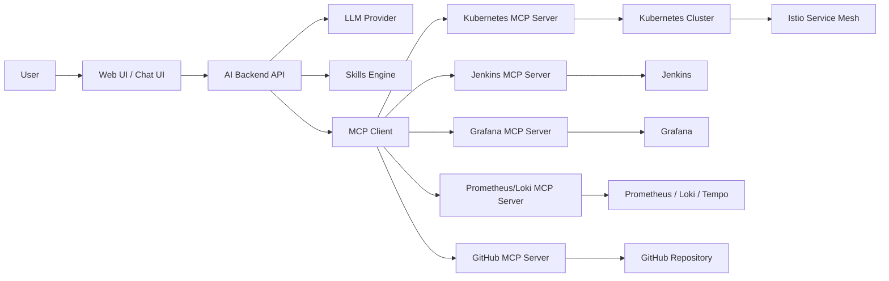

# AI Side Project Direction

## 프로젝트 한 줄 설명

**MCP와 Skills를 활용해 Kubernetes 환경의 배포, 장애 분석, 관측, 롤백을 도와주는 AI DevOps Copilot**을 만든다.

## 저장소

- Git URL: `git@github.com:SeungHyeog/AI.git`
- 문서 목적: 초기 방향성 정리 및 리뷰용
- 현재 문서: `PROJECT_DIRECTION.md`

## 프로젝트 이름 후보

- `KubePilot AI`
- `AIOps Copilot`
- `ReleaseOps AI`

권장 이름은 **KubePilot AI**다. Kubernetes 중심성이 명확하고, 이후 Jenkins, Grafana, Istio, MCP를 붙여도 의미가 자연스럽다.

## 핵심 목표

이 프로젝트의 목표는 단순 챗봇이 아니라, 실제 운영 환경에서 사용할 수 있는 **AI 기반 배포 및 장애 대응 도우미**를 만드는 것이다.

AI는 사용자의 질문에 답변하는 것뿐 아니라, MCP 서버를 통해 Kubernetes, Jenkins, Grafana, GitHub, 로그/메트릭 시스템에서 정보를 가져와 근거 있는 답변과 실행 제안을 제공한다.

## 해결하려는 문제

- Kubernetes 장애 원인 파악이 느리다.
- Jenkins 배포 실패 시 로그를 사람이 직접 뒤져야 한다.
- Grafana 대시보드와 Prometheus 메트릭을 보고 해석하는 시간이 오래 걸린다.
- Istio 트래픽, VirtualService, DestinationRule 설정 문제를 빠르게 찾기 어렵다.
- 신규 배포 전 위험 요소를 자동으로 점검하기 어렵다.
- 장애 발생 시 롤백 판단과 명령 정리가 수동적이다.

## 최종 사용자 시나리오

### 1. 배포 전 위험 점검

사용자가 다음처럼 요청한다.

```text
이번 PR 배포해도 괜찮아? staging 기준으로 위험 요소 확인해줘.
```

AI는 다음 정보를 확인한다.

- 변경된 파일과 Dockerfile, Helm chart, Kubernetes manifest
- 최근 Jenkins 빌드 결과
- staging namespace의 현재 Pod 상태
- Istio 라우팅 설정
- 최근 에러율, latency, restart count

결과 예시:

```text
배포 가능하지만 주의가 필요합니다.

위험 요소:
- payment-api의 readinessProbe timeout이 현재 p95 latency보다 낮습니다.
- Istio VirtualService에 canary weight가 남아 있습니다.
- 최근 30분간 5xx 비율이 1.8%로 SLO 기준에 근접했습니다.

권장 조치:
- readinessProbe timeout을 3s에서 5s로 조정
- canary weight 초기화 확인
- staging에서 smoke test 후 production 승인
```

### 2. 장애 분석

사용자가 다음처럼 요청한다.

```text
production에서 checkout-api가 느려졌어. 원인 분석해줘.
```

AI는 다음을 수행한다.

- Kubernetes Pod, Deployment, Event 확인
- Istio request latency, error rate 확인
- Grafana/Prometheus 메트릭 확인
- Jenkins 최근 배포 이력 확인
- 로그에서 에러 패턴 요약

결과 예시:

```text
가장 가능성 높은 원인은 DB connection pool 고갈입니다.

근거:
- checkout-api p95 latency가 14:03 이후 230ms에서 2.8s로 증가
- 같은 시각 Jenkins build #182 배포 완료
- Pod restart는 없지만 active DB connection이 max에 도달
- 로그에 `connection timeout`이 5분간 142회 발생

권장 조치:
- checkout-api 이전 버전으로 롤백
- DB connection pool 설정 변경 검토
- HPA 기준에 DB wait time metric 추가 고려
```

### 3. 롤백 지원

사용자가 다음처럼 요청한다.

```text
checkout-api를 이전 안정 버전으로 롤백하는 절차 알려줘.
```

AI는 환경 정보를 확인하고 다음을 제공한다.

- 현재 배포 버전
- 이전 안정 버전
- Jenkins rollback job 또는 Helm rollback 명령
- 롤백 후 확인해야 할 Grafana 지표
- Istio 트래픽 복구 확인 방법

실제 명령 실행은 초기 버전에서는 하지 않고, 사람이 승인한 뒤 실행하는 구조로 둔다.

## 전체 아키텍처



## 주요 기술 스택

### AI / Backend

- Python 3.12
- FastAPI
- LangGraph 또는 OpenAI Responses API 기반 workflow
- MCP client
- Pydantic
- PostgreSQL 또는 SQLite
- Redis, 선택 사항

### MCP

초기에는 직접 MCP 서버를 만든다.

- `kubernetes-mcp`: namespace, pod, deployment, event, service, ingress, HPA 조회
- `jenkins-mcp`: job status, build log, artifact, rollback job 조회
- `grafana-mcp`: dashboard, panel, alert, datasource query 지원
- `github-mcp`: PR diff, commit, issue, release note 조회
- `observability-mcp`: Prometheus query, Loki log search, Tempo trace 조회

처음부터 모든 MCP 서버를 만들기보다, 1차 MVP에서는 `kubernetes-mcp`, `jenkins-mcp`, `grafana-mcp`만 구현한다.

### Skills

Skills는 특정 운영 작업을 재사용 가능한 절차로 정의한다.

초기 Skills 후보:

- `incident-triage`: 장애 원인 분석
- `deployment-risk-review`: 배포 전 위험 점검
- `rollback-planner`: 롤백 절차 생성
- `slo-report`: SLO/SLA 리포트 생성
- `istio-traffic-review`: Istio 라우팅 및 트래픽 정책 점검
- `jenkins-failure-analysis`: Jenkins 실패 로그 요약

Skill 예시 구조:

```text
skills/
  incident-triage.md
  deployment-risk-review.md
  rollback-planner.md
  istio-traffic-review.md
```

각 Skill 문서에는 다음을 포함한다.

- 목적
- 필요한 MCP 도구
- 확인 순서
- 위험 판단 기준
- 사용자에게 보여줄 결과 형식
- 실행 가능한 명령은 승인 전까지 제안만 한다는 원칙

### Infrastructure

- Kubernetes
- Istio
- Helm
- Jenkins
- Grafana
- Prometheus
- Loki
- Tempo, 선택 사항
- Docker
- Trivy 또는 Grype 이미지 취약점 스캔
- Argo CD, 선택 사항

### Frontend

초기 버전은 단순하게 간다.

- Next.js 또는 React
- 채팅 UI
- 분석 결과 카드
- 관련 메트릭 링크
- Jenkins build 링크
- Kubernetes resource 링크

MVP에서는 Web UI보다 Backend와 MCP 연동을 우선한다.

## CI/CD 방향

Jenkins를 중심으로 CI/CD를 구성한다.

### 기본 흐름

```mermaid
flowchart LR
    Dev[Developer Push] --> GitHub[GitHub]
    GitHub --> Jenkins[Jenkins Pipeline]
    Jenkins --> Test[Unit / Integration Test]
    Test --> Build[Docker Build]
    Build --> Scan[Image Scan]
    Scan --> Registry[Container Registry]
    Registry --> DeployStaging[Deploy to Staging]
    DeployStaging --> Smoke[Smoke Test]
    Smoke --> Approval[Manual Approval]
    Approval --> DeployProd[Deploy to Production]
    DeployProd --> Verify[Grafana / Prometheus Verify]
```



### Jenkins Pipeline 단계

1. Checkout
2. Lint
3. Unit Test
4. Build Docker Image
5. Security Scan
6. Push Image
7. Helm Template Validation
8. Deploy to Staging
9. Smoke Test
10. Manual Approval
11. Deploy to Production
12. Post-deploy Metric Check

### AI가 CI/CD에서 할 수 있는 일

- Jenkins 실패 로그 요약
- 실패 원인 후보 제시
- 배포 전 PR 위험도 분석
- 배포 후 Grafana 지표 기반 이상 여부 판단
- 롤백 절차 자동 생성
- 릴리즈 노트 생성

## Kubernetes / Istio 구성 방향

### Kubernetes 대상 구성

- `ai-backend` Deployment
- `ai-frontend` Deployment
- `mcp-kubernetes` Deployment
- `mcp-jenkins` Deployment
- `mcp-grafana` Deployment
- `postgres` 또는 외부 DB
- `redis`, 선택 사항

### Istio 적용 범위

- IngressGateway를 통한 외부 진입
- mTLS 적용
- VirtualService 기반 라우팅
- DestinationRule 기반 traffic policy
- Canary 배포 실험
- timeout, retry, circuit breaker 정책

### 예시 namespace

```text
ai-system
ai-staging
ai-production
observability
jenkins
```

## Observability 방향

Grafana는 단순 모니터링 화면이 아니라 AI 분석의 근거 데이터 소스로 사용한다.

### 수집 지표

- HTTP request rate
- HTTP 4xx/5xx rate
- p50/p95/p99 latency
- Pod restart count
- CPU / memory usage
- HPA scale event
- Istio request duration
- Istio upstream error
- Jenkins build duration
- Jenkins failure count

### Grafana Dashboard 후보

- AI Backend Overview
- MCP Server Overview
- Jenkins Pipeline Health
- Kubernetes Workload Health
- Istio Traffic Overview
- Incident Timeline

## 보안 방향

- MCP 서버는 최소 권한 원칙을 적용한다.
- Kubernetes ServiceAccount는 namespace 단위 read 권한부터 시작한다.
- 운영 명령 실행은 기본적으로 비활성화한다.
- 롤백, 재배포, scale 변경 등은 사용자 승인 후 실행한다.
- Jenkins token, Grafana token, GitHub token은 Kubernetes Secret으로 관리한다.
- CI에서 secret scanning과 image vulnerability scanning을 수행한다.
- 감사 로그를 남긴다.

## MVP 범위

처음부터 거대한 AIOps 플랫폼을 만들지 않고, 다음 범위로 시작한다.

### MVP 1차

- FastAPI 기반 AI Backend
- 기본 Chat API
- Kubernetes MCP Server
- Jenkins MCP Server
- Grafana/Prometheus MCP Server
- `incident-triage` Skill
- `deployment-risk-review` Skill
- Jenkinsfile
- Dockerfile
- Helm chart
- Kubernetes staging 배포

### MVP에서 제외

- 자동 운영 명령 실행
- 복잡한 multi-agent 구조
- 자체 LLM 학습
- 대규모 권한 관리 UI
- 완전한 production-grade 인증/인가

## 단계별 로드맵

### Phase 1. 프로젝트 뼈대

- Repository 구조 생성
- FastAPI Backend 생성
- 기본 Chat API 생성
- Dockerfile 작성
- Jenkinsfile 작성
- Helm chart 작성

### Phase 2. MCP 연동

- Kubernetes MCP Server 구현
- Jenkins MCP Server 구현
- Grafana/Prometheus MCP Server 구현
- AI Backend에서 MCP client 연결

### Phase 3. Skills 적용

- `incident-triage` Skill 작성
- `deployment-risk-review` Skill 작성
- Skill 선택 로직 구현
- Skill 실행 결과 포맷 표준화

### Phase 4. Kubernetes 배포

- staging namespace 구성
- Istio Gateway / VirtualService 구성
- Grafana dashboard 구성
- Prometheus metric 확인

### Phase 5. CI/CD 완성

- Jenkins pipeline 완성
- Docker image build/push
- Helm deploy
- smoke test
- manual approval
- post-deploy metric check

### Phase 6. 고도화

- Loki 로그 분석 추가
- Tempo trace 분석 추가
- 롤백 planner 추가
- GitHub PR review 연동
- Slack 또는 Discord 알림 연동

## 추천 Repository 구조

```text
AI/
  README.md
  PROJECT_DIRECTION.md
  Jenkinsfile
  docker-compose.yml
  apps/
    backend/
      app/
      tests/
      Dockerfile
      pyproject.toml
    frontend/
      src/
      Dockerfile
      package.json
  mcp-servers/
    kubernetes/
    jenkins/
    grafana/
  skills/
    incident-triage.md
    deployment-risk-review.md
    rollback-planner.md
    istio-traffic-review.md
  deploy/
    helm/
      ai-backend/
      ai-frontend/
      mcp-kubernetes/
      mcp-jenkins/
      mcp-grafana/
    istio/
      gateway.yaml
      virtual-service.yaml
      destination-rule.yaml
  observability/
    grafana-dashboards/
    prometheus-rules/
  docs/
    architecture.md
    cicd.md
    mcp.md
    skills.md
```

## 주요 의사결정 포인트

리뷰하면서 아래 항목을 결정하면 다음 단계 구현 방향이 명확해진다.

1. LLM provider를 무엇으로 할지
2. Backend 언어를 Python으로 확정할지
3. Frontend를 MVP에 포함할지
4. MCP 서버를 직접 만들지, 기존 서버를 조합할지
5. Jenkins만 사용할지, Argo CD도 함께 사용할지
6. 실제 Kubernetes cluster를 local kind/minikube로 시작할지, cloud cluster로 시작할지
7. 운영 명령 실행을 언제 허용할지
8. 인증/인가를 MVP에 어느 정도 포함할지

## 권장 초기 결정

- Backend: Python FastAPI
- Frontend: MVP 이후로 미룸
- Cluster: local kind 또는 minikube로 시작
- CI/CD: Jenkins 중심
- Deploy: Helm
- Service Mesh: Istio
- Observability: Prometheus + Grafana, 이후 Loki 추가
- MCP: 직접 구현
- Skills: Markdown 기반으로 시작
- 운영 명령 실행: MVP에서는 제안만, 실행은 사람이 직접

## 다음 작업 후보

문서 리뷰 후 다음 중 하나를 선택하면 된다.

1. Repository 기본 구조 생성
2. FastAPI Backend MVP 생성
3. Jenkinsfile 초안 작성
4. Kubernetes/Helm 배포 템플릿 작성
5. MCP 서버 1개부터 구현
6. Skills 문서 초안 작성

## 현재 결론

이 프로젝트는 **AI 챗봇 프로젝트**가 아니라, Kubernetes 운영 환경을 실제로 읽고 분석하는 **AI DevOps/AIOps 프로젝트**로 잡는 것이 좋다.

기술 조합은 다음 방향이 가장 자연스럽다.

- Kubernetes는 실행 환경
- Istio는 트래픽 제어와 서비스 메시
- Grafana/Prometheus는 관측 데이터 소스
- Jenkins는 CI/CD 중심축
- MCP는 외부 시스템 연결 계층
- Skills는 운영 분석 절차를 재사용하는 지식 계층
- AI Backend는 MCP와 Skills를 조합해 판단하는 두뇌 역할
